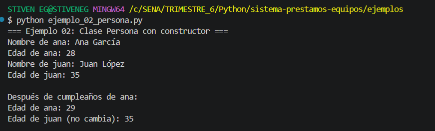
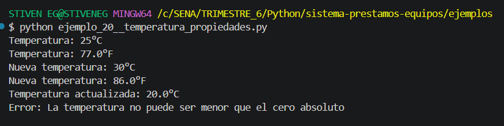
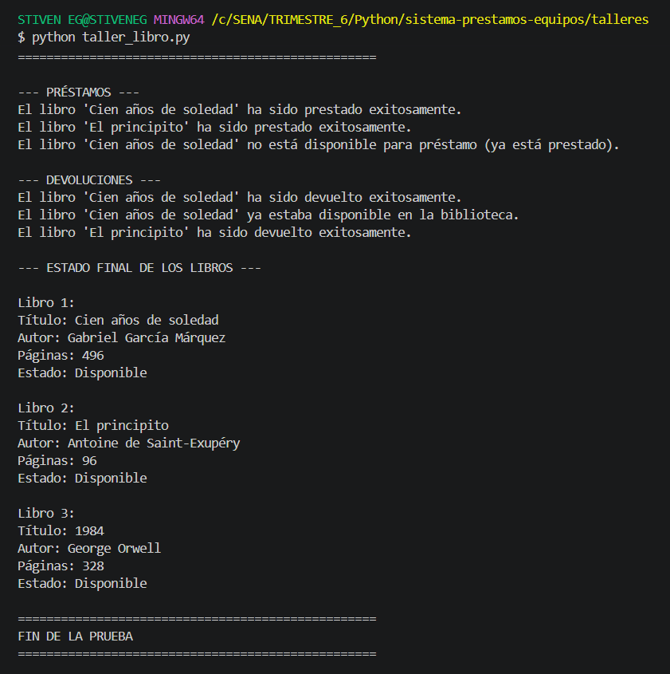
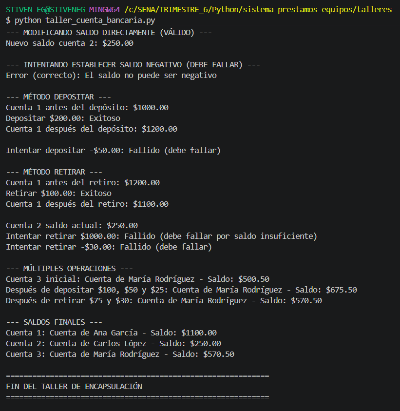
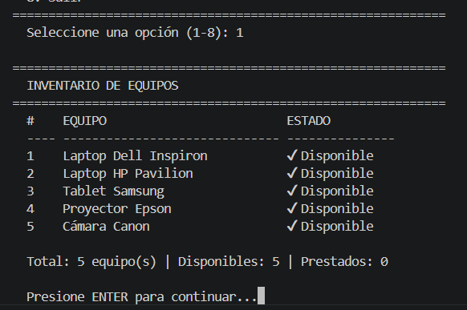
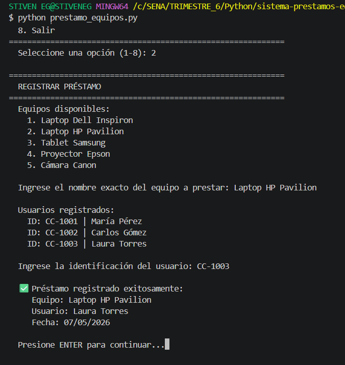
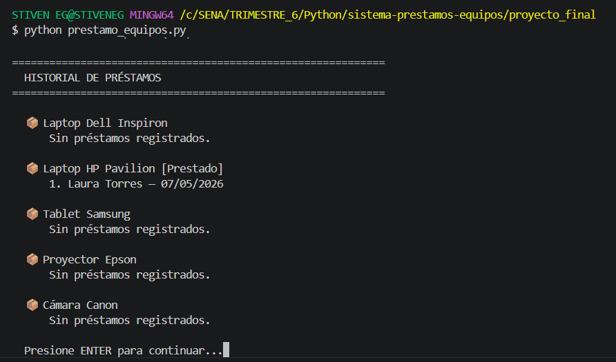
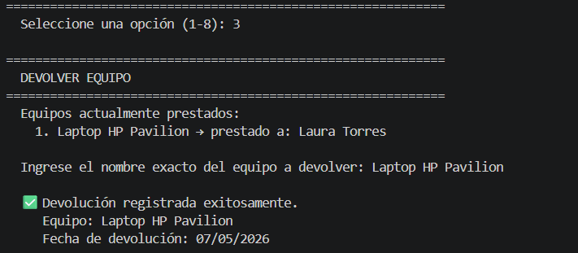
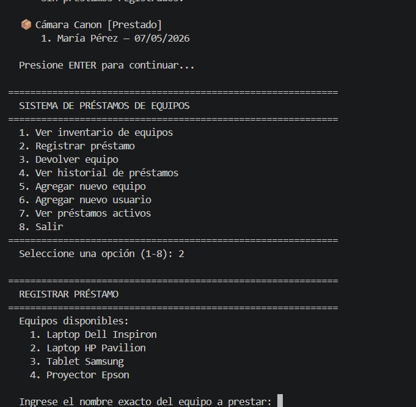
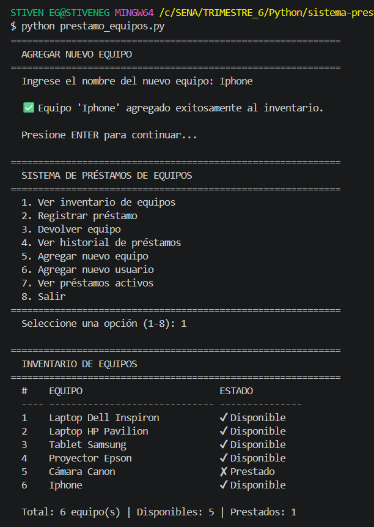

# Sistema de Préstamos de Equipos
### GA1-220501093-04-AA1-EV04 — Fundamentos de Python: Clases, Objetos y Encapsulación
**SENA — Formación Tecnológica en Programación de Software**

## AUTOR 
**Stiven Escobar Gomez** 

---

## Descripción del proyecto

Este proyecto es una aplicación de consola desarrollada en **Python** que gestiona el inventario, préstamos y devoluciones de equipos de cómputo dentro de una institución educativa. Fue desarrollado como **reto integrador** de la actividad GA1-220501093-04-AA1-EV04, aplicando los conceptos de **Programación Orientada a Objetos (POO)** y **encapsulación**.

---

# Estructura del Proyecto

```bash
SISTEMA-PRESTAMOS-EQUIPOS/
│
├── capturas/
│
├── ejemplos/
│   ├── ejemplo_01_coche.py
│   ├── ejemplo_02_persona.py
│   └── ... (30 ejemplos en total)
│
├── proyecto_final/
│   └── prestamo_equipos.py
│
├── talleres/
│   ├── taller_cuenta_bancaria.py
│   └── taller_libro.py
│
└── README.md

```

--- 

## Diseño de clases y encapsulación

El proyecto integrador está construido con **4 clases principales** que modelan el mundo real del sistema de préstamos, aplicando encapsulación en cada una.

---

### Diagrama de clases

```text
┌─────────────────────┐        ┌─────────────────────┐
│       Equipo        │        │       Usuario        │
├─────────────────────┤        ├─────────────────────┤
│ - __nombre          │        │ - __nombre           │
│ - __disponible      │        │ - __identificacion   │
│ - __historial []    │        │ - __prestamos_activos│
├─────────────────────┤        ├─────────────────────┤
│ + nombre @property  │        │ + nombre @property   │
│ + disponible        │        │ + identificacion     │
│ + estado            │        │ + prestamos_activos  │
│ + historial (copia) │        │ + puede_pedir        │
│ + registrar_prestamo│        │ + agregar_prestamo() │
│ + registrar_devol() │        │ + quitar_prestamo()  │
└────────┬────────────┘        └──────────┬───────────┘
         │                               │
         └──────────────┬────────────────┘
                        │
              ┌─────────▼──────────┐
              │       Prestamo     │
              ├────────────────────┤
              │ - __equipo         │
              │ - __usuario        │
              │ - __fecha_prestamo │
              │ - __fecha_devol    │
              │ - __activo         │
              ├────────────────────┤
              │ + resumen @property│
              │ + cerrar()         │
              └─────────┬──────────┘
                        │ gestiona
              ┌─────────▼──────────────┐
              │    SistemaPrestamos    │
              ├────────────────────────┤
              │ - __equipos  {}        │
              │ - __usuarios {}        │
              │ - __prestamos []       │
              ├────────────────────────┤
              │ + mostrar_equipos()    │
              │ + registrar_prestamo() │
              │ + devolver_equipo()    │
              │ + ver_historial()      │
              │ + agregar_equipo()     │
              │ + agregar_usuario()    │
              │ + menu()              │
              └────────────────────────┘
```

---

### Clase `Equipo` — Encapsulación de disponibilidad

Representa un equipo físico del inventario. Sus atributos más sensibles — la disponibilidad y el historial — están **completamente protegidos** con doble guion bajo (`__`).

```python
class Equipo:
    def __init__(self, nombre):
        self.__nombre = nombre        # Privado con name mangling
        self.__disponible = True      # Solo se cambia con métodos controlados
        self.__historial = []         # Lista interna nunca expuesta directamente

    @property
    def historial(self):
        return self.__historial.copy()  # Se devuelve COPIA para proteger la lista

    @property
    def estado(self):
        return "Disponible" if self.__disponible else "Prestado"

    def registrar_prestamo(self, usuario):
        if not self.__disponible:
            return False
        fecha_hoy = date.today().strftime("%d/%m/%Y")
        self.__historial.append((usuario, fecha_hoy))  # Tupla inmutable
        self.__disponible = False
        return True
```

**Conceptos aplicados:**
- `__nombre`, `__disponible`, `__historial` → atributos privados (name mangling)
- `@property` → getter de solo lectura para `nombre`, `estado`, `historial`
- El historial retorna una **copia** para que nadie pueda modificarlo externamente
- Cada préstamo se guarda como **tupla inmutable** `(usuario, fecha)`

---

### Clase `Usuario` — Validación con métodos privados y setters

Modela al usuario que solicita préstamos. Usa **métodos privados** para validar los datos de entrada y un **setter** para permitir actualizar el nombre con validación.

```python
class Usuario:
    LIMITE_PRESTAMOS = 3  # Atributo de clase compartido

    def __init__(self, nombre, identificacion):
        self.__nombre = self.__validar_nombre(nombre)          # Método privado
        self.__identificacion = self.__validar_identificacion(identificacion)
        self.__prestamos_activos = []

    def __validar_nombre(self, nombre):            # Método privado __
        if not isinstance(nombre, str) or not nombre.strip():
            raise ValueError("El nombre no puede estar vacío.")
        return nombre.strip().title()

    @property
    def puede_pedir_prestamo(self):                # Propiedad calculada
        return len(self.__prestamos_activos) < Usuario.LIMITE_PRESTAMOS

    @nombre.setter
    def nombre(self, nuevo_nombre):                # Setter con validación
        self.__nombre = self.__validar_nombre(nuevo_nombre)
```

**Conceptos aplicados:**
- Métodos privados `__validar_nombre()` y `__validar_identificacion()` para encapsular la lógica de validación
- Propiedad calculada `puede_pedir_prestamo` que evalúa el estado en tiempo real
- Setter con re-uso del método privado de validación
- Atributo de clase `LIMITE_PRESTAMOS` compartido por todas las instancias

---

### Clase `Prestamo` — Propiedades de solo lectura

Modela la transacción entre un equipo y un usuario. Sus datos son esencialmente **inmutables** después de crearse: no tienen setters, solo getters.

```python
class Prestamo:
    def __init__(self, equipo, usuario):
        self.__equipo = equipo
        self.__usuario = usuario
        self.__fecha_prestamo = date.today().strftime("%d/%m/%Y")
        self.__fecha_devolucion = None
        self.__activo = True

    @property
    def fecha_devolucion(self):               # Getter con lógica condicional
        return self.__fecha_devolucion if self.__fecha_devolucion else "Aún no devuelto"

    @property
    def resumen(self):                        # Propiedad calculada compleja
        estado = "ACTIVO" if self.__activo else "CERRADO"
        return (
            f"  Equipo:  {self.__equipo.nombre}\n"
            f"  Usuario: {self.__usuario.nombre}\n"
            f"  Estado:  {estado}"
        )

    def cerrar(self):                         # Único método que cambia el estado
        if not self.__activo:
            return False
        self.__fecha_devolucion = date.today().strftime("%d/%m/%Y")
        self.__activo = False
        return True
```

**Conceptos aplicados:**
- Todas las propiedades son de **solo lectura** (sin setters)
- `resumen` es una propiedad calculada que combina varios atributos
- El estado solo puede cambiar a través del método `cerrar()`, garantizando integridad

---

### Clase `SistemaPrestamos` — Encapsulación del inventario completo

Es el controlador principal. Protege los tres almacenes de datos principales con doble guion bajo y usa métodos privados para búsquedas internas.

```python
class SistemaPrestamos:
    def __init__(self):
        self.__equipos   = {}   # dict: nombre → Equipo
        self.__usuarios  = {}   # dict: id     → Usuario
        self.__prestamos = []   # list: [Prestamo, ...]

    def __buscar_equipo(self, nombre):     # Método privado de búsqueda
        return self.__equipos.get(nombre, None)

    @property
    def equipos_disponibles(self):         # Propiedad calculada
        return [e for e in self.__equipos.values() if e.disponible]
```

**Estructuras de datos utilizadas:**

| Estructura | Uso en el proyecto |
|---|---|
| **Diccionario** | `__equipos` y `__usuarios` — acceso rápido por clave |
| **Lista** | `__prestamos` y `__historial` de cada equipo |
| **Tupla** | Cada registro de préstamo `(usuario, fecha)` — inmutable |

---

## ▶️ Ejemplos de ejecución en consola

#### Ejemplos/




### Talleres





## PROYECTO FINAL
### 1. Ver inventario de equipos



---

### 2. Registrar un préstamo





---

### 3. Ver historial de préstamos 



---

### 4. Devolver un equipo 




---

### 5. Intentar prestar un equipo ya ocupado 




---

### 6. Agregar un nuevo equipo 



---

## 🚀 Cómo ejecutar el proyecto

**Requisitos:** Python 3.8 o superior instalado.

```bash
# 1. Clonar el repositorio
git clone https://github.com/stivenescobarg/sistema_prestamo_equipos.git

# 2. Ingresar a la carpeta del proyecto final
cd sistema-prestamos-equipos/proyecto_final

# 3. Ejecutar el sistema
python prestamos_equipos.py
```

Para ejecutar los ejemplos individuales:

```bash
# Desde la raíz del repositorio
python ejemplos/ejemplo_01_coche.py
python ejemplos/ejemplo_08_temperatura.py
# ... etc.
```

---

## 💡 Reflexión personal sobre aprendizajes y retos superados

### ¿Qué aprendí?

Con este proyecto entendí mucho mejor cómo funciona la Programación Orientada a Objetos. Antes hacía todo con variables y diccionarios sueltos, pero ahora veo que usar clases ayuda a organizar mejor el código y hacerlo más fácil de entender.

### ¿Qué fue lo más difícil?

Lo más complicado fue organizar la clase Prestamo, porque al principio intenté manejar todo desde una sola clase y el código quedó muy enredado. También me costó entender la encapsulación y por qué era importante proteger los datos.
